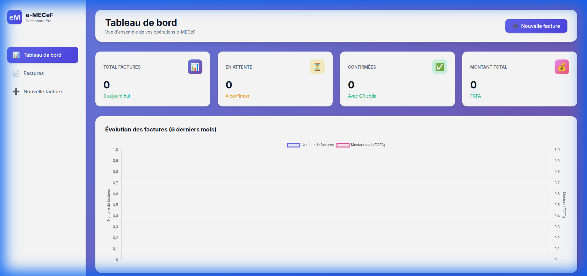
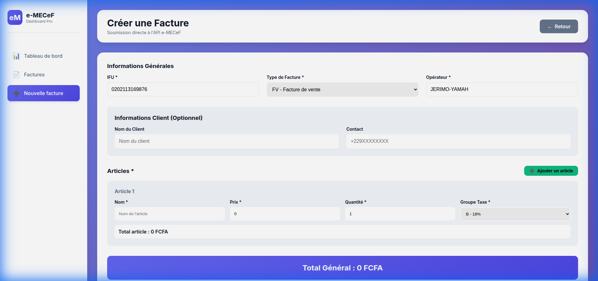
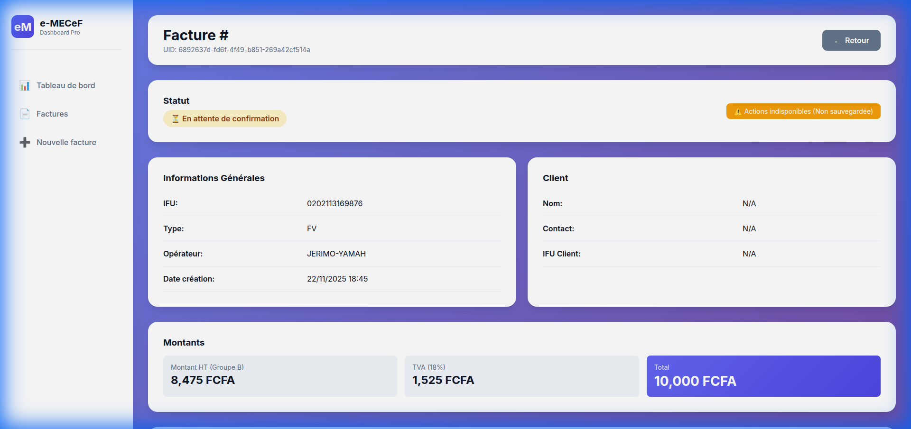

# Service e-MECeF pour Laravel

Un package Laravel complet pour l'intégration de l'API e-MECeF (Module de contrôle dématérialisé) de la DGI du Bénin.

## 📋 Table des matières

- [Introduction](#introduction)
Lara-Sygmef Package 🇧🇯

[](https://packagist.org/packages/codianselme/lara-sygmef)
[](https://packagist.org/packages/codianselme/lara-sygmef)
[](https://packagist.org/packages/codianselme/lara-sygmef)

**Lara-Sygmef** est un package Laravel complet pour intégrer facilement l'API de facturation électronique **e-MECeF** du Bénin. Il offre une interface fluide pour gérer vos factures, confirmer les transactions et générer les codes QR réglementaires, le tout via une API propre ou un **Tableau de Bord prêt à l'emploi**.

---

## 🚀 Fonctionnalités Clés

*   ✅ **Intégration API Complète** : Création, confirmation, annulation de factures (FV, EV, FA, EA).
*   ✅ **Tableau de Bord Intégré** : Interface graphique moderne pour gérer vos factures sans coder.
*   ✅ **Gestion des Avoirs** : Support complet des factures d'avoir (FA) avec liaison automatique.
*   ✅ **QR Code & Sécurité** : Génération et affichage des QR Codes et codes MECeF/DGI.
*   ✅ **Mode Démo / Test** : Environnement de test (Sandbox) pré-configuré.
*   ✅ **Persistance** : Sauvegarde automatique des factures et items en base de données.

---

## 📦 Installation

Installez le package via Composer :

```bash
composer require codianselme/lara-sygmef
```

### 1. Publication des ressources

Publiez le fichier de configuration et les assets (CSS/JS pour le dashboard) :

```bash
php artisan vendor:publish --tag=emecf-config
php artisan vendor:publish --tag=emecf-assets
```

### 2. Base de données

Exécutez les migrations pour créer les tables nécessaires (`emecf_invoices`, `emecf_invoice_items`, etc.) :

```bash
php artisan migrate
```

---

## ⚙️ Configuration

Ajoutez les variables suivantes à votre fichier `.env` :

```dotenv
# Token d'accès API e-MECeF (Fourni par la DGI)
EMECF_API_TOKEN=votre_token_ici

# Mode Test (true pour Sandbox, false pour Production)
EMECF_TEST_MODE=true
```

---

## 🖥️ Tableau de Bord (Dashboard)

Le package inclut un tableau de bord complet accessible via `/emecf/dashboard`.

### 1. Vue d'overview
Accédez aux statistiques de vos ventes, graphiques mensuels et dernières factures.



### 2. Création de Facture
Un formulaire intuitif pour créer des factures de vente (FV) ou des avoirs (FA).
*   **Calcul automatique** des totaux.
*   **Gestion dynamique** des articles.
*   **Support des Avoirs** : Le champ "Référence" apparaît automatiquement si vous choisissez "FA".



### 3. Confirmation & QR Code
Après création, confirmez la facture pour obtenir le **Code MECeF/DGI** et le **QR Code** officiel.


*(Après confirmation)*


---

## 💻 Utilisation de l'API (Code)

Vous pouvez utiliser la façade `EmecfService` ou l'injecter dans vos contrôleurs.

### 1. Créer une Facture de Vente (FV)

```php
use Codianselme\LaraSygmef\Services\EmecfService;

public function createInvoice(EmecfService $service)
{
    $data = [
        'ifu' => '0202113169876',
        'type' => 'FV', // Facture de Vente
        'operator' => ['name' => 'John Doe'], // Nom de l'opérateur caisse
        'client' => [
            'name' => 'Client Example',
            'contact' => '+22997000000'
        ],
        'items' => [
            [
                'name' => 'Article 1',
                'price' => 10000,
                'quantity' => 1,
                'taxGroup' => 'B' // B = 18% (TVA)
            ]
        ],
        'payment' => [
            ['name' => 'ESPECES', 'amount' => 10000]
        ]
    ];

    $result = $service->submitInvoice($data);

    if ($result['success']) {
        return $result['data']['uid']; // UID de la facture
    }
}
```

### 2. Confirmer une Facture

Une facture créée est en attente. Elle doit être confirmée pour être valide.

```php
$uid = '...'; // UID reçu lors de la création
$result = $service->finalizeInvoice($uid, 'confirm');

if ($result['success']) {
    $qrCode = $result['data']['qrCode'];
    $codeMECeF = $result['data']['codeMECeFDGI'];
    // Sauvegardez ces infos !
}
```

### 3. Créer une Facture d'Avoir (FA)

Pour annuler ou corriger une facture, créez une **Facture d'Avoir**.

⚠️ **IMPORTANT** : Le champ `reference` doit contenir le **Code MECeF/DGI** de la facture d'origine, **SANS les tirets** (24 caractères).

```php
$data = [
    'ifu' => '0202113169876',
    'type' => 'FA', // Facture d'Avoir
    'reference' => 'TEST2TJKLKV6722QZNX2U6PO', // Code MECeF sans tirets !
    'operator' => ['name' => 'John Doe'],
    'items' => [ ... ], // Articles retournés
    'payment' => [ ... ]
];

    // Format : "F;{NIM};{CODE_COURT};{IFU};{DATETIME}"
}
```

#### Annulation d'une Facture

```php
// Annuler une facture en attente
$cancellation = $emecf->finalizeInvoice($uid, 'cancel');
```

### Autres Opérations

```php
// Vérifier le statut de l'API
$status = $emecf->getInvoiceStatus();

// Récupérer les groupes de taxation
$taxGroups = $emecf->getTaxGroups();

// Récupérer les types de factures
$invoiceTypes = $emecf->getInvoiceTypes();

// Récupérer les types de paiement
$paymentTypes = $emecf->getPaymentTypes();
```

### Via les Routes API

Si vous avez publié les routes (`php artisan vendor:publish --tag=emecf-routes`), vous pouvez utiliser les endpoints suivants :

| Méthode | Endpoint | Description |
|---------|----------|-------------|
| `GET` | `/emecf/status` | Statut de l'API |
| `POST` | `/emecf/invoices` | Soumettre une facture |
| `PUT` | `/emecf/invoices/{uid}/finalize` | Finaliser (confirm/cancel) |
| `GET` | `/emecf/invoices/{uid}/pending` | Détails facture en attente |

## 🎨 Dashboard Web

Le package inclut un **dashboard web complet et professionnel** pour gérer vos factures via une interface moderne.

### Accès au Dashboard

```bash
# Publier les routes dashboard
php artisan vendor:publish --tag=emecf-dashboard

# Accéder au dashboard
http://votre-app.test/emecf/dashboard
```

### Fonctionnalités du Dashboard

- 📊 **Statistiques en temps réel** avec graphiques
- 📄 **Gestion complète des factures** (liste, création, détails)
- ✅ **Confirmation en un clic** avec génération du QR code
- 🔍 **Filtres avancés** (statut, date, recherche)
- 📱 **Design responsive** et moderne
- 🎨 **Interface premium** avec animations

### Documentation Complète

Pour plus de détails sur le dashboard, consultez : [docs/DASHBOARD.md](docs/DASHBOARD.md)

## 🧪 Tests


Pour lancer les tests du package :

```bash
composer test
```

## 📄 Licence

Ce package est sous licence MIT.
